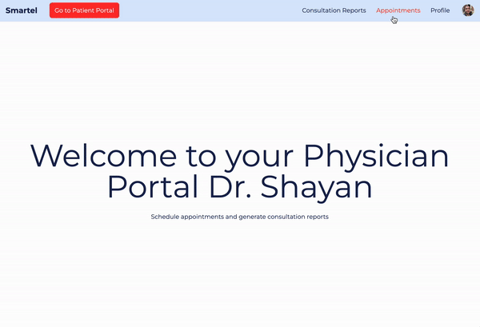
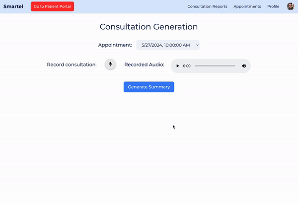
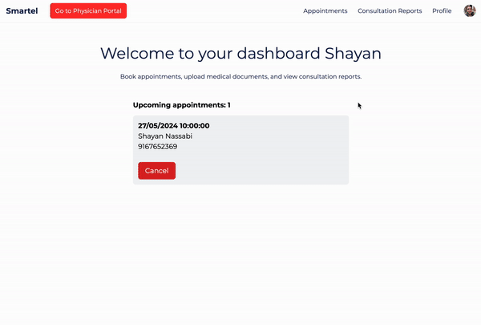
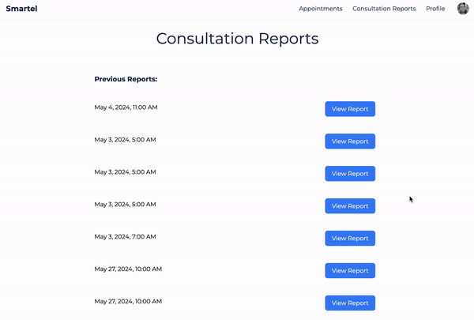

<div align="center">
  
</div>

# Smartel - Online Telehealth Portal

## Features

- Schedule appointments as a physician
  <div align="center">
    
  </div>
- AI powered consultation summary generation
  <div align="center">
    
  </div>
- Book appointments as a patient
  <div align="center">
    
  </div>
- View summary documents from previous consultations.
  <div align="center">
    
  </div>

## Backend commands

To set up and manage the backend environment, follow these commands:

1. **Create a virtual environment**:

   ```bash
   python3 -m venv .venv
   ```

2. **Activate the virtual environment:**:

   ```bash
   source .venv/bin/activate
   ```

3. **Install required packages from requirements.txt:**:

   ```bash
   pip install -r requirements.txt
   ```

4. **Deactivate the virtual environment when you're done:**:
   ```bash
   deactivate
   ```
